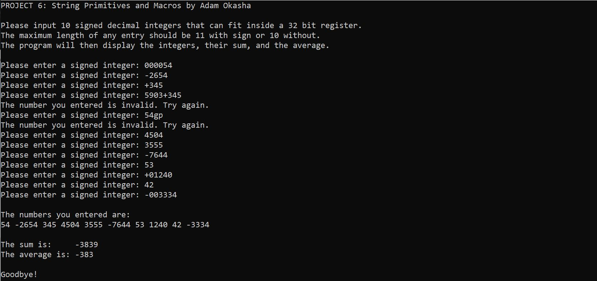

# CS 271 Project 6 String Primitives and Macros

## Description

This program takes in 10 numeric user inputs (that can fit in a 32 bit register) as a string and converts them to signed numeric form (SDWORD). Numbers can be positive or negative. Thus the range of valid numbers are between -2147483648 and 2147483647.

The numbers are then converted back to string equivalents and displayed.
Finally the sums and averages are calculated.

### Macros

**mGetString**: Displays a prompt and read user input
**mDisplayString**: Prints string displayed in a memory location.

### Procs
**ReadVal**: Uses string primitive to convert strings of ascii digits to numeric SDWORD values. Also validates user inputs.
**WriteVal**: Converts numeric SDWORD value to string of ASCII digits. 

### Requirements:
- `ReadInt`, `ReadDec`, `WriteInt` and `WriteDec` are not allowed
- Conversion routines must use `LODSB` and/or `STOSB` where appropriate
- Proc params must be passed on stack
- Strings must be passed by reference
- Used registers must be saved and restored
- No referencing data segment variables by name outside of `main`
- Register indirect access must be used for accessing SDWORD int array elements
- Base +off set addressing must be used for accessing params on runtime stack 
- Averages can be floored

### Example output
